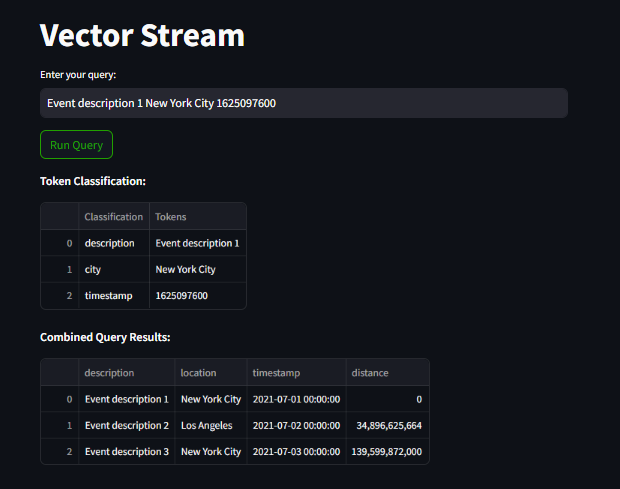

# Vector Stream
This project generates multi-modal vector embeddings for event descriptions, geolocation data, and timestamps which are then available to be queried by a user via a Streamlit interface. The application dynamically categorizes each token in the user's query for appropriate embedding. This project uses Streamlit as the front-end, PyTorch and Hugging Face Transformers, and FAISS for similarity searches.

## Table of Contents
- [Overview](#multi-modal-vector-embeddings-and-similarity-search)
- [Requirements](#requirements)
- [Examples](#examples)

## Multi-Modal Vector Embeddings and Similarity Search

### Embedding Details
* **Description:** 768 dimensions using BERT
* **Location:** 768 dimensions using BERT
* **Timestamp:** 128 dimensions using a linear layer
* **Total Dimensionality before collapse to shared space:** 1664 dimensions
* **Total Dimensionality after collapse to shared space:** 512 - arbitrarily selected

### Multi-Modal Embedding Approach
**Pros:**
* **Granular Control:** Detailed analysis of each component.
* **Integrated Context:** Learns dependencies between different data types.
* **Flexibility:** Queries can target any subset of modalities.

**Cons:**
* **Complex Training:** Needs careful design and tuning.
* **Increased Model Complexity:** Requires sophisticated architecture.

### Traditional Single Index Approach
Combines all values into a single text field before embedding generation.

**Pros:**
* **Simplicity:** Easier to implement with a single model.
* **Unified Context:** Embedding captures integrated context.

**Cons:**
* **Loss of Specificity:** Less distinct representation of data types.
* **Potential for Overload:** Concatenated input may reduce learning effectiveness.
* **Flexibility Limitations:** Less flexible for independent queries.

## Requirements
- streamlit
- torch
- faiss-cpu
- numpy
- pandas
- transformers
- sentence-transformers

You can install the required libraries using pip:
```bash
pip install requirements.txt
```

## Examples

**Multi-modal combined index search**

