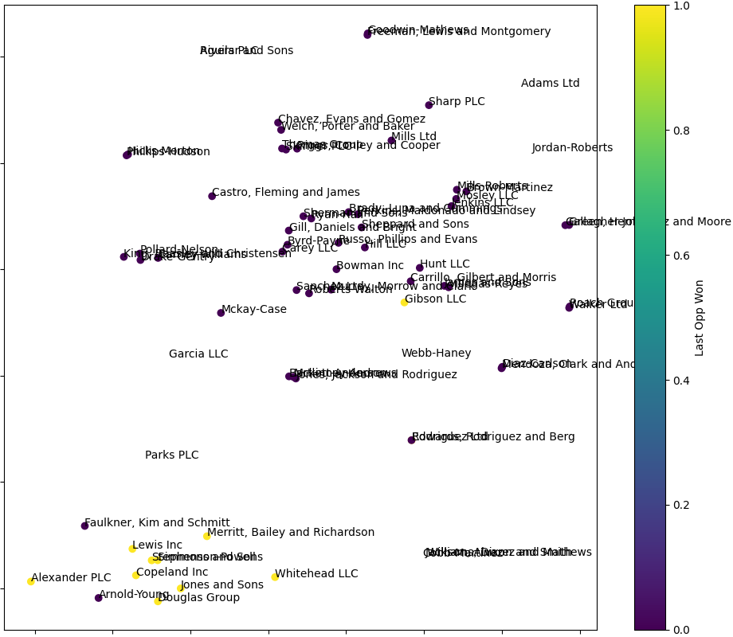

# Transformer-Based Graph Embedding for Node Clustering

This application generates a NetworkX graph object from relational data which is used to generate embeddings for each record using Node2Vec and Sentence-BERT, followed by clustering and visualization of the results. The application leverages DuckDB for efficient data processing and querying.

## Salesforce Account and Opportunity Graph Analysis Example

### Features

- Load and preprocess Salesforce account and opportunity data.
- Create a graph of accounts with edges based on shared industry and date criteria.
- Generate textual embeddings for account features using Sentence-BERT.
- Combine textual embeddings with numerical features.
- Generate comprehensive node embeddings using Node2Vec.
- Cluster the accounts using K-Means clustering. https://scikit-learn.org/stable/modules/generated/sklearn.cluster.KMeans
- Visualize the clusters using t-SNE. https://scikit-learn.org/stable/modules/generated/sklearn.manifold.TSNE

### Why Use This Application for Salesforce Data?

Analyzing Salesforce account and opportunity data using this methodology provides several key benefits:

- **Enhanced Relationship Insights:** By visualizing the connections between accounts based on shared attributes and opportunities, sales teams can identify clusters of similar accounts, uncover hidden relationships, and better understand customer segments.
- **Improved Targeting and Strategy:** Clustering accounts using advanced graph and machine learning techniques enables more precise targeting, allowing sales teams to tailor their strategies for different clusters, improving overall sales efficiency and effectiveness.
- **Data-Driven Decision Making:** The use of graph-based embeddings and clustering provides a robust foundation for data-driven decision making, helping sales managers prioritize high-potential accounts and optimize resource allocation.

### Installation

1. Install the required Python packages:
    ```sh
    pip install duckdb pandas networkx node2vec gensim matplotlib scikit-learn sentence-transformers
    ```

### Usage

1. Place your Salesforce account and opportunity CSV files in the `demo_data` directory, or use the already provided synthetic data. Ensure the file names match the script references. 

2. Run the script:
    ```sh
    python main.py
    ```

### Example

The t-SNE visualization below was generated from 100 records of synthetic Salesforce account and opportunity data.

- All accounts in this cluster had their most recent opportunities marked as won (recent_is_won = 1).
- Groupings such as the cluster in the lower left suggest that the accounts might share similar values for other attributes like account_type, industry, country, opportunity_count, total_opportunity_amount, and avg_opportunity_probability.


