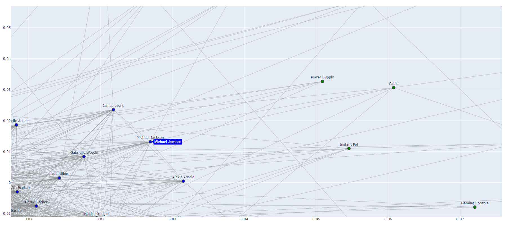

### Transformer-Based Graph Embedding for Node Clustering

This application generates a NetworkX graph object from relational data, which is used to generate embeddings for each record using Node2Vec and Sentence-BERT. It then clusters the embeddings and visualizes the results. The application includes scripts to load, preprocess, and visualize synthetic e-commerce data.

### Features

- Load and preprocess e-commerce data (customers, products, purchases, co-purchases).
- Create a graph with customers and products as nodes.
- Add edges for purchases, co-purchases, customer similarity, temporal relations, and semantic similarity between products.
- Generate node embeddings using Node2Vec.
- Cluster the nodes using K-Means clustering. https://scikit-learn.org/stable/modules/generated/sklearn.cluster.KMeans
- Visualize the graph and clusters interactively using Plotly.

### Installation

1. Install the required Python packages:
    ```sh
    pip install matplotlib networkx plotly pandas sentence-transformers numpy node2vec gensim scikit-learn
    ```

### Usage

1. Place your synthetic e-commerce data CSV files (`customers.csv`, `products.csv`, `purchases.csv`, `co_purchases.csv`) in the `demo_data` directory, or use the provided files, or generated your own files using the provided `data_gen.py` script. 

2. Run the main script to generate and visualize the graph:
    ```sh
    python main.py
    ```

### Example

The interactive visualization displays the graph with nodes representing customers and products, and edges representing various types of relationships. Nodes are colored based on their type (customers in blue, products in green), and clusters are highlighted to reveal patterns and insights.

Michael Jackson might be interested in a power supply or an Instapot! 


### Files and Functions

#### main.py

- Loads the data from CSV files.
- Creates the graph and adds various types of edges.
- Generates node embeddings using Node2Vec.
- Clusters the nodes and visualizes the results.

#### graph_builder.py

- Defines functions to load the data and create the graph.
- Adds nodes for customers and products.
- Adds edges for purchases, co-purchases, customer similarity, temporal relations, and semantic similarity between products.

#### feature_encoder.py

- Extracts and encodes node features for use in Node2Vec.

#### node2vec_model.py

- Generates node embeddings using Node2Vec.
- Loads the Node2Vec model and retrieves embeddings.
- Performs clustering on the embeddings.

#### visualization.py

- Visualizes the graph and clusters using Plotly for interactive visualization.
- Provides 2D and 3D visualization functions.
